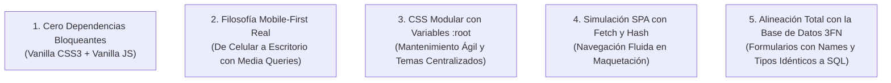

# 🛡️ Documento 02: Guía Maestra de Defensa para la Presentación del SGDM (ASCEND)

---

## 🎯 1. Objetivo de la Defensa
El propósito de esta presentación es defender y justificar con solvencia técnica, profesionalismo y rigor arquitectónico cómo está construido actualmente el Front-End (la interfaz visual y la interacción del usuario) del **Sistema de Gestión Deportiva Modular (ASCEND)**, demostrando que:

1. El sistema no es un prototipo improvisado, sino una arquitectura desacoplada, modular y profesional.
2. Cumple con los estándares internacionales de diseño web moderno (**Mobile-First**, **HTML5 Semántico**, **CSS3 Modular con Variables** y **JavaScript Vanilla puro**).
3. La interfaz y la base de datos están rigurosamente alineadas en **Tercera Forma Normal (3FN)** y listas para la integración con **PHP** y **MySQL** en el servidor.

---

## 🎙️ 2. Guion de Apertura (El "Pitch" Inicial - 2 a 3 Minutos)

> *"Muy buenos días / tardes a todos los presentes.*
>
> *Hoy tengo el agrado de presentarles la arquitectura del Front-End del **SGDM (Sistema de Gestión Deportiva Modular - ASCEND)**. Nuestra plataforma ha sido concebida para resolver una necesidad real en el ámbito competitivo: la gestión integral, transparente y automatizada de competencias tanto para **deportes tradicionales** (como Rugby, Fútbol 5) como para disciplinas de **deportes electrónicos o eSports** (como Valorant o League of Legends).*
>
> *En esta etapa fundamental de desarrollo, nos hemos enfocado en construir una base visual y de experiencia de usuario sólida, 100% responsiva y completamente desacoplada. Hemos elegido trabajar con tecnologías nativas web —**HTML5 semántico**, **CSS3 modular basado en variables y diseño Mobile-First**, y **JavaScript Vanilla nativo sin dependencias externas pesadas**— garantizando tiempos de carga casi instantáneos, total control del código y accesibilidad universal.*
>
> *Asimismo, la interfaz no es estática: implementa un sistema dinámico de navegación para maquetación que simula el comportamiento de una Single Page Application, validación de datos en tiempo real, menús adaptativos y confirmaciones de seguridad. Toda esta estructura visual se encuentra estrictamente mapeada con un modelo de base de datos relacional normalizado en Tercera Forma Normal (3FN), listo para iniciar la programación del Backend en PHP la próxima semana.*
>
> *A continuación, pasaré a demostrarles los componentes visuales, los módulos del administrador y las decisiones técnicas de ingeniería que sustentan este proyecto."*

---

## 💎 3. Los 5 Pilares de Ingeniería que Debes Resaltar

Durante la presentación o demostración en vivo, apóyate siempre en estos cinco argumentos fundamentales:

### 1. ¿Por qué usamos Vanilla CSS y Vanilla JS (sin Bootstrap, Tailwind ni React)?
* **Argumento de Defensa**: *"Elegir código nativo nos otorga un control absoluto sobre el rendimiento. Frameworks como Bootstrap o librerías como React cargan cientos de kilobytes de código innecesario para un panel de administración donde la prioridad es la velocidad de respuesta y la ligereza. Nuestro CSS pesa menos de 30 KB y nuestro JS se ejecuta en milisegundos, sin vulnerabilidades de paquetes de terceros."*

### 2. ¿Por qué el enfoque Mobile-First (Primero Móvil)?
* **Argumento de Defensa**: *"Los organizadores y jugadores acceden a los torneos desde sus teléfonos inteligentes en la cancha o el escenario de juego. Diseñar primero para pantallas móviles (`layout.css` base) asegura que la interfaz nunca se rompa en un teléfono; las tablas tienen desplazamiento horizontal protegido (`overflow-x: auto;`), los menús se ocultan en un panel lateral deslizante y los botones tienen zonas táctiles cómodas. Luego, mediante Media Queries (`@media (min-width: 768px)`), la interfaz se expande automáticamente a pantallas grandes de escritorio."*

### 3. ¿Por qué el CSS está dividido en varios archivos (`base.css`, `layout.css`, etc.)?
* **Argumento de Defensa**: *"Aplicamos el principio de Separación de Responsabilidades (SoC - Separation of Concerns). `base.css` almacena los tokens globales de color mediante variables `:root`; si mañana la directiva decide cambiar el color azul primario por violeta, se cambia una sola línea y todo el sistema se actualiza. `layout.css` maneja la grilla espacial, `componentes.css` las piezas reutilizables (tablas, tarjetas, formularios) y `utilidades.css` los botones y badges."*

### 4. ¿Por qué se usó un enrutador de maquetación (`mockup-router.js`)?
* **Argumento de Defensa**: *"Para poder validar y recorrer todos los flujos de usuario (crear torneo, editar perfil, asignar roles, cargar resultados) de forma interactiva y fluida antes de levantar el servidor PHP. Utiliza la API `fetch()` nativa y escucha el evento `hashchange` de la URL para inyectar dinámicamente cada vista dentro del contenedor `#area-contenido`, simulando además los tiempos de respuesta del servidor (800 ms) y las alertas emergentes (Toasts)."*

### 5. ¿Por qué separamos la tabla `usuarios` en perfiles de jugadores y organizadores?
* **Argumento de Defensa**: *"Para garantizar el cumplimiento riguroso de la Tercera Forma Normal (3FN) mediante el patrón de diseño Class Table Inheritance (Herencia de Tablas / Subtipos 1 a 1). En lugar de tener una tabla monolítica llena de columnas vacías (NULLs), la tabla `usuarios` almacena solo la identidad de acceso universal (email, contraseña cifrada, rol), mientras que las tablas hijas `perfiles_jugadores` y `perfiles_organizadores` almacenan estrictamente los atributos propios de cada especialización. Esto maximiza la velocidad de autenticación y evita anomalías de datos."*

---

## ❓ 4. Batería de Preguntas Difíciles de los Evaluadores y Cómo Responderlas

A continuación tienes las preguntas técnicas más comunes que suele formular un tribunal o profesor examinador, junto con la respuesta exacta que debes dar:

---

### Pregunta 1: *"Veo que la navegación funciona con almohadillas (#torneos/crear). ¿Por qué no hicieron enlaces directos a archivos HTML independientes?"*
> **Tu Respuesta:**
> *"Hicimos esto deliberadamente para implementar el patrón de Single Page Application (SPA) en la etapa de maquetación. Si enlazáramos archivos `.html` completos e independientes para cada pantalla, tendríamos que duplicar el código del Header, del Sidebar y del Footer en 20 archivos distintos. Cualquier cambio en el menú nos obligaría a editar 20 archivos a mano.
> Con nuestro enfoque, `index.html` actúa como plantilla contenedora fija y `mockup-router.js` inyecta únicamente el cuerpo de cada sección (`#area-contenido`). Esto prepara el terreno perfecto para que la próxima semana, al pasar a PHP, reemplacemos ese router JS por un Front Controller en PHP (`index.php?vista=...`) usando `require_once`, manteniendo exactamente el mismo principio de plantilla única sin duplicación de código."*

---

### Pregunta 2: *"¿Qué sucede con la seguridad si un usuario malintencionado desactiva JavaScript en su navegador? ¿Se salta las validaciones?"*
> **Tu Respuesta:**
> *"No, en absoluto. La validación en JavaScript (`admin.js` interceptando el evento `submit` sobre `.validacion-activa`) y los atributos HTML5 (`required`, `type="email"`, `min="2"`) son una primera barrera diseñada para la **Experiencia de Usuario (UX)**, para avisar al usuario inmediatamente sin esperar un viaje de red.
> En la arquitectura de software profesional, la seguridad crítica reside siempre en el **Servidor (Backend)**. La próxima semana, al programar los controladores en PHP, cada dato recibido en `$_POST` pasará por funciones de sanitización (`htmlspecialchars`, `filter_var`), validación de tipos, verificación de tokens CSRF (Cross-Site Request Forgery - Falsificación de Petición en Sitios Cruzados) y ejecución mediante **Sentencias Preparadas con PDO (PHP Data Objects)** para anular al 100% el riesgo de Inyección SQL."*

---

### Pregunta 3: *"¿Cómo aseguran que el sistema sea accesible para personas con discapacidades o que usen lectores de pantalla?"*
> **Tu Respuesta:**
> *"Hemos priorizado la accesibilidad web (estándares W3C / WCAG):
> 1. Usamos **HTML5 semántico estricto**: `<header>`, `<nav>`, `<aside>`, `<main>`, `<section>`, `<article>`, `<fieldset>` y `<legend>`. Los lectores de pantalla reconocen la jerarquía del documento de inmediato.
> 2. Los campos de formulario están explícitamente vinculados con sus etiquetas mediante `<label for="id_del_input">`.
> 3. Las notificaciones dinámicas utilizan atributos ARIA como `aria-live="polite"` para que los lectores anuncien los cambios de estado sin interrumpir al usuario.
> 4. Los contrastes de color entre el texto gris oscuro `#333333` y los fondos claros `#ffffff` cumplen con el ratio mínimo de contraste de 4.5:1 exigido para legibilidad."*

---

### Pregunta 4: *"¿Cómo soporta su diseño deportes tan distintos como Fútbol (físico) y Valorant (videojuego shooter) sin tener que rediseñar las pantallas?"*
> **Tu Respuesta:**
> *"El sistema es modular y multideportivo por diseño. En el módulo de Disciplinas ([juegos/formulario.html](file:///c:/Users/juani/Documents/GitHub/SGDM/codigo_fuente/vistas/admin/juegos/formulario.html)) y en la base de datos (tablas `juegos`, `modalidades` y `sistemas_puntuacion`), los parámetros del deporte no están grabados 'a fuego' en el código, sino configurados dinámicamente:
> * Si el torneo es de Valorant, se define modalidad Equipos (5v5), formato Eliminación Directa, sistema al Mejor de 3 mapas (BO3) y tipo de resultado por rondas.
> * Si el torneo es de Fútbol 5 o Rugby, se define modalidad Equipos (5v5 o 7v7), formato Liga de todos contra todos, con 3 puntos por victoria, 1 por empate y resultado por goles/puntos.
> Las pantallas de carga de resultados y tablas de posiciones se adaptan automáticamente a estas variables del deporte seleccionado."*

---

### Pregunta 5: *"¿Por qué afirman que la base de datos está en Tercera Forma Normal (3FN)?"*
> **Tu Respuesta:**
> *"Porque cumple con los tres requisitos fundamentales de la normalización de bases de datos:
> 1. **Primera Forma Normal (1FN)**: Todos los valores en las columnas son atómicos e indivisibles. No guardamos listas de miembros ni cadenas separadas por comas dentro de una celda; utilizamos tablas intermedias como `equipo_miembros`, `rol_permisos` o `usuario_logros`.
> 2. **Segunda Forma Normal (2FN)**: Cumple 1FN y en todas las tablas con clave primaria compuesta (por ejemplo `rol_permisos(rol_id, permiso_id)`), cada columna no clave depende de la clave primaria completa, no de una parte de ella.
> 3. **Tercera Forma Normal (3FN)**: Cumple 2FN y no existen dependencias transitivas ni columnas condicionales. Mediante la herencia de tablas, los datos de acceso universal están en `usuarios`, los datos exclusivos del competidor están en `perfiles_jugadores` y los datos institucionales están en `perfiles_organizadores`, todos enlazados con claves foráneas e integridad referencial en cascada (`ON DELETE CASCADE` y `ON DELETE SET NULL`)."*

---

## 🧭 5. Recomendaciones Prácticas para el Momento de la Exposición

1. **Abre el navegador antes de empezar**: Ten abierta la pestaña con `vistas/admin/index.html` y abre también las herramientas de desarrollo (*F12 -> Pestaña Consola y Red*) para mostrar que no hay errores de JavaScript ni dependencias rotas.
2. **Muestra la adaptabilidad móvil**: En las herramientas de desarrollador, activa la vista de emulación de dispositivos móviles (*Ctrl + Shift + M*), despliega el menú hamburguesa lateral y desliza horizontalmente una tabla para que los evaluadores aprecien el trabajo de diseño Mobile-First en vivo.
3. **Navega por los módulos clave**:
   * Pasa por el **Dashboard** explicando las tarjetas métricas (KPIs).
   * Ingresa a **Torneos -> Crear Torneo** para mostrar la agrupación de campos con `<fieldset>`.
   * Ve a **Resultados -> Cargar Resultado** para ilustrar cómo se vincula el torneo con los equipos y los puntajes.
   * Haz clic en **Comunicaciones -> Enviar Comunicado** y en **Configuración -> General** para mostrar las políticas de seguridad de contraseñas.
4. **Cierre contundente**: Finaliza recordando que todo este trabajo front-end deja la mesa servida para que la conexión con PHP y MySQL sea directa, limpia y sin necesidad de rehacer pantallas.
