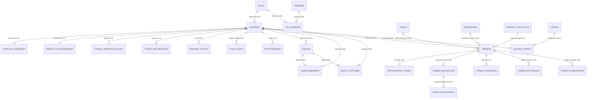

# 📊 Documento 03: Diccionario de Datos Completo y Mapeo Técnico (HTML ➔ PHP ➔ MySQL)

---

## 🎯 1. Propósito del Diccionario de Datos
Este documento es la referencia técnica fundamental para el equipo de desarrollo. Define de forma exhaustiva y normalizada:
1. La estructura relacional en **Tercera Forma Normal (3FN)** del script [base_de_datos/sgdm_multideporte.sql](file:///c:/Users/juani/Documents/GitHub/SGDM/base_de_datos/sgdm_multideporte.sql).
2. El patrón de diseño de **Herencia de Tablas (Class Table Inheritance / Subtipos 1 a 1)** para separar la identidad de los usuarios de sus perfiles especializados (`perfiles_jugadores` y `perfiles_organizadores`).
3. El mapeo exacto entre los campos de los **Formularios HTML5 (`<input name="...">`, `<select name="...">`)**, los métodos de petición **HTTP (`GET` / `POST`)**, el tipo de dato que procesará **PHP (Hypertext Preprocessor)** en el servidor y la columna de destino en la base de datos **MySQL**.

---

## 🌐 2. Glosario de Términos y Siglas de Base de Datos

* **SQL (Structured Query Language - Lenguaje de Consulta Estructurada)**: Lenguaje estándar de programación para crear, modificar, consultar y eliminar información en bases de datos relacionales.
* **PK (Primary Key - Clave Primaria)**: Columna o conjunto de columnas cuyos valores identifican de forma unívoca e irrepetible a cada fila o registro de una tabla. No puede contener valores nulos (`NULL`).
* **FK (Foreign Key - Clave Foránea / Forastera)**: Columna en una tabla que hace referencia a la Clave Primaria de otra tabla, estableciendo una relación formal y garantizando la integridad de los datos.
* **3FN (Tercera Forma Normal)**: Estado de diseño relacional donde se garantiza la atomicidad de los datos (1FN), la ausencia de dependencias parciales en claves compuestas (2FN) y la eliminación de dependencias transitivas (3FN). Ningún dato no clave depende de otra columna que no sea la clave primaria.
* **Class Table Inheritance (Herencia de Tablas de Clase)**: Patrón de diseño de base de datos donde se crea una tabla padre para los datos comunes a todas las entidades, y tablas hijas separadas para los datos exclusivos de cada subtipo, vinculadas por una relación `1:1` donde la clave primaria de la tabla hija es a la vez su clave foránea hacia el padre.
* **ON DELETE CASCADE (Eliminación en Cascada)**: Regla de integridad referencial donde, al eliminar un registro padre, el motor de la base de datos elimina de forma automática todos los registros hijos que dependen de él.
* **ON DELETE SET NULL (Fijar en Nulo al Eliminar)**: Regla donde, al eliminar el registro padre, el valor de la clave foránea en los registros hijos se convierte automáticamente en `NULL`, evitando que se pierda el historial de eventos o auditorías.
* **ON DELETE RESTRICT (Restringir Eliminación)**: Regla que prohíbe terminantemente borrar un registro padre mientras existan registros hijos que lo estén referenciando, protegiendo la integridad del sistema.
* **RBAC (Role-Based Access Control - Control de Acceso Basado en Roles)**: Modelo de seguridad donde los privilegios del sistema se asignan a roles (por ejemplo: Administrador, Organizador, Participante) y los usuarios heredan los permisos del rol que tienen asignado.
* **PDO (PHP Data Objects - Objetos de Datos de PHP)**: Extensión oficial de PHP que provee una interfaz orientada a objetos, segura y unificada para interactuar con bases de datos como MySQL, facilitando el uso de sentencias preparadas contra inyecciones SQL.

---

## 🏛️ 3. Diagrama Entidad-Relación y Estructura de Herencia

---

## 📖 4. Diccionario de Tablas y Mapeo Detallado de Módulos

A continuación se detalla cada módulo funcional, los campos del formulario HTML correspondiente, la variable procesada por PHP (`$_POST` o `$_GET`), el tipo de dato y la columna exacta en la base de datos MySQL:

---

### 👤 MÓDULO A: Identidad, Autenticación y Herencia de Perfiles

#### 1. Tabla Padre: `usuarios` (Superclase de Cuentas de Acceso)
Almacena exclusivamente los datos comunes de autenticación para cualquier persona que ingresa a la plataforma.

| Columna SQL | Tipo de Dato MySQL | Clave | Nulo | Valor por Defecto | Descripción y Validaciones |
| :--- | :--- | :---: | :---: | :--- | :--- |
| `id` | `INT AUTO_INCREMENT` | **PK** | No | Auto | Identificador único irrepetible del usuario. |
| `email` | `VARCHAR(255)` | **UNIQUE** | No | Ninguno | Correo electrónico de acceso. Debe ser un email válido. |
| `contrasena_hash` | `TEXT` | - | No | Ninguno | Contraseña cifrada en PHP con `password_hash($clave, PASSWORD_BCRYPT)`. Nunca almacenar en texto plano. |
| `nombre_completo` | `VARCHAR(255)` | - | No | Ninguno | Nombre y apellido oficial de la persona. |
| `telefono` | `VARCHAR(20)` | - | Sí | `NULL` | Número de teléfono de contacto. |
| `foto_perfil_url` | `TEXT` | - | Sí | `NULL` | Ruta o URL de la fotografía de perfil o avatar. |
| `rol_id` | `INT` | **FK** | No | Ninguno | Referencia a `roles(id)`. Regla: `ON DELETE RESTRICT`. |
| `esta_activo` | `BOOLEAN` | - | No | `TRUE` (`1`) | Estado de la cuenta (`1: Activa`, `0: Suspendida / Bloqueada`). |
| `email_verificado` | `BOOLEAN` | - | No | `FALSE` (`0`) | Indica si el usuario confirmó su correo tras el registro. |
| `fecha_registro` | `TIMESTAMP` | - | No | `CURRENT_TIMESTAMP` | Fecha y hora exacta de alta de la cuenta. |
| `ultimo_acceso` | `TIMESTAMP` | - | Sí | `NULL` | Fecha y hora del último inicio de sesión exitoso. |

---

#### 2. Tabla Hija (Subtipo Jugador): `perfiles_jugadores`
Almacena los datos exclusivos de los deportistas y competidores. Posee una relación `1:1` con `usuarios`.

| Columna SQL | Tipo de Dato MySQL | Clave | Nulo | Valor por Defecto | Descripción y Validaciones |
| :--- | :--- | :---: | :---: | :--- | :--- |
| `usuario_id` | `INT` | **PK, FK** | No | Ninguno | Clave Primaria y Foránea a `usuarios(id)` con `ON DELETE CASCADE`. |
| `apodo_gamertag` | `VARCHAR(50)` | - | Sí | `NULL` | Nombre de jugador o alias en el juego (ej. *ShadowStriker*). |
| `bio` | `TEXT` | - | Sí | `NULL` | Biografía o presentación personal pública. |
| `banner_url` | `TEXT` | - | Sí | `NULL` | Imagen de portada para la cabecera de su perfil. |
| `nivel` | `INT` | - | No | `1` | Nivel actual de rango del jugador (Gamificación). |
| `experiencia_puntos` | `INT` | - | No | `0` | Puntos acumulados ganados en torneos y logros. |
| `pais` | `VARCHAR(100)` | - | Sí | `'Uruguay'` | País de residencia. |
| `ciudad` | `VARCHAR(100)` | - | Sí | `NULL` | Ciudad o departamento de residencia. |
| `fecha_nacimiento` | `DATE` | - | Sí | `NULL` | Fecha de nacimiento para validaciones de edad en torneos. |
| `discord_tag` | `VARCHAR(100)` | - | Sí | `NULL` | Nombre de usuario en Discord (ej. *Usuario#1234*). |
| `instagram_url` | `VARCHAR(255)` | - | Sí | `NULL` | Enlace a su perfil de Instagram. |
| `twitter_url` | `VARCHAR(255)` | - | Sí | `NULL` | Enlace a su cuenta de X / Twitter. |
| `actualizado_en` | `TIMESTAMP` | - | No | `CURRENT_TIMESTAMP` | Fecha de última modificación del perfil (`ON UPDATE CURRENT_TIMESTAMP`). |

---

#### 3. Tabla Hija (Subtipo Organizador): `perfiles_organizadores`
Almacena los datos de instituciones, clubes o personas encargadas de crear y gestionar torneos.

| Columna SQL | Tipo de Dato MySQL | Clave | Nulo | Valor por Defecto | Descripción y Validaciones |
| :--- | :--- | :---: | :---: | :--- | :--- |
| `usuario_id` | `INT` | **PK, FK** | No | Ninguno | Clave Primaria y Foránea a `usuarios(id)` con `ON DELETE CASCADE`. |
| `nombre_organizacion` | `VARCHAR(150)` | - | No | `'Organizador Independiente'` | Nombre del club, empresa, facultad o comunidad. |
| `bio_organizacion` | `TEXT` | - | Sí | `NULL` | Resumen institucional y trayectoria. |
| `localidad` | `VARCHAR(100)` | - | Sí | `NULL` | Sede o ciudad donde opera la organización. |
| `telefono_contacto` | `VARCHAR(50)` | - | Sí | `NULL` | Teléfono institucional para consultas de torneos. |
| `sitio_web` | `VARCHAR(255)` | - | Sí | `NULL` | Página web oficial de la institución. |
| `verificado_oficial` | `BOOLEAN` | - | No | `FALSE` (`0`) | Distintivo de organizador verificado por el administrador. |
| `actualizado_en` | `TIMESTAMP` | - | No | `CURRENT_TIMESTAMP` | Fecha de última actualización (`ON UPDATE CURRENT_TIMESTAMP`). |

---

### 📋 Mapeo Formulario ➔ PHP ➔ MySQL (Usuarios y Perfiles)

* **Vistas HTML Involucradas**:
  * [vistas/admin/usuarios/formulario.html](file:///c:/Users/juani/Documents/GitHub/SGDM/codigo_fuente/vistas/admin/usuarios/formulario.html)
  * [vistas/auth/registro.html](file:///c:/Users/juani/Documents/GitHub/SGDM/codigo_fuente/vistas/auth/registro.html)
  * [vistas/organizador/perfil.html](file:///c:/Users/juani/Documents/GitHub/SGDM/codigo_fuente/vistas/organizador/perfil.html)
  * [vistas/jugador/perfil-jugador.html](file:///c:/Users/juani/Documents/GitHub/SGDM/codigo_fuente/vistas/jugador/perfil-jugador.html)

| Campo en HTML (`name` / `id`) | Método HTTP | Variable en PHP | Tipo PHP | Tabla Destino | Columna Destino SQL | Validación y Procesamiento en PHP |
| :--- | :---: | :--- | :---: | :--- | :--- | :--- |
| `name="nombre"` | `POST` | `$_POST['nombre']` | `string` | `usuarios` | `nombre_completo` | `trim(strip_tags($_POST['nombre']))`. Longitud 3 a 255 caracteres. |
| `name="correo"` | `POST` | `$_POST['correo']` | `string` | `usuarios` | `email` | `filter_var($_POST['correo'], FILTER_VALIDATE_EMAIL)`. Comprobar que no exista en BD. |
| `name="contrasena"` | `POST` | `$_POST['contrasena']` | `string` | `usuarios` | `contrasena_hash` | `password_hash($_POST['contrasena'], PASSWORD_BCRYPT, ['cost' => 10])`. |
| `name="rol"` | `POST` | `$_POST['rol']` | `int` | `usuarios` | `rol_id` | `(int)$_POST['rol']`. Comprobar que exista en tabla `roles`. |
| `name="telefono"` | `POST` | `$_POST['telefono']` | `string` | `usuarios` | `telefono` | Expresión regular para números telefónicos. |
| `id="inputOrganizacion"` | `POST` | `$_POST['organizacion']`| `string`| `perfiles_organizadores` | `nombre_organizacion` | Requerido si el rol es Organizador. |
| `id="inputLocalidad"` | `POST` | `$_POST['localidad']` | `string` | `perfiles_organizadores` | `localidad` | Sanitización de caracteres especiales. |
| `id="inputBiografia"` | `POST` | `$_POST['biografia']` | `string` | `perfiles_organizadores` | `bio_organizacion` | Longitud máxima 300 caracteres. |
| `id="input-banner"` | `POST (FILE)` | `$_FILES['banner']` | `array` | `perfiles_jugadores` | `banner_url` | Validación MIME de imagen (`image/jpeg`, `image/png`), redimensionado y subida segura al servidor. |
| `id="input-avatar"` | `POST (FILE)` | `$_FILES['avatar']` | `array` | `usuarios` | `foto_perfil_url` | Validación de tamaño (máx 2MB), subida a `publico/uploads/avatars/`. |

---

### 🏆 MÓDULO B: Torneos, Disciplinas y Encuentros

#### 1. Tabla: `juegos` (Catálogo de Disciplinas)
| Columna SQL | Tipo de Dato MySQL | Clave | Nulo | Valor por Defecto | Descripción |
| :--- | :--- | :---: | :---: | :--- | :--- |
| `id` | `INT AUTO_INCREMENT` | **PK** | No | Auto | Identificador de la disciplina deportiva o eSport. |
| `nombre` | `VARCHAR(100)` | **UNIQUE** | No | Ninguno | Nombre del juego (ej. *Valorant*, *Fútbol 5*, *Rugby 7s*). |
| `categoria` | `VARCHAR(50)` | - | No | Ninguno | Categoría: `esport-shooter`, `esport-moba`, `deporte-fisico`, `juego-mesa`. |
| `formato_equipo_defecto` | `INT` | - | No | `1` | Jugadores estándar por equipo (1 para individual, 5, 7, 11). |
| `puntos_victoria` | `DECIMAL(5,2)` | - | No | `3.00` | Puntos otorgados por ganar un partido. |
| `puntos_empate` | `DECIMAL(5,2)` | - | No | `1.00` | Puntos otorgados por empatar. |
| `puntos_derrota` | `DECIMAL(5,2)` | - | No | `0.00` | Puntos otorgados por perder. |
| `activo` | `BOOLEAN` | - | No | `TRUE` | Permite habilitar o deshabilitar la disciplina. |

---

#### 2. Tabla: `torneos` (Estructura de la Competencia)
| Columna SQL | Tipo de Dato MySQL | Clave | Nulo | Valor por Defecto | Descripción |
| :--- | :--- | :---: | :---: | :--- | :--- |
| `id` | `INT AUTO_INCREMENT` | **PK** | No | Auto | Identificador único del torneo. |
| `nombre` | `VARCHAR(255)` | - | No | Ninguno | Título oficial de la competencia. |
| `juego_id` | `INT` | **FK** | No | Ninguno | Referencia a `juegos(id)` (`ON DELETE RESTRICT`). |
| `organizador_id` | `INT` | **FK** | No | Ninguno | Referencia a `usuarios(id)` (`ON DELETE RESTRICT`). |
| `formato` | `VARCHAR(50)` | - | No | Ninguno | `liga`, `eliminacion_directa`, `suizo`. |
| `estado` | `VARCHAR(50)` | - | No | `'borrador'` | `'borrador'`, `'inscripciones_abiertas'`, `'en_curso'`, `'finalizado'`, `'cancelado'`. |
| `modalidad_id` | `INT` | **FK** | No | `1` | Referencia a `modalidades(id)` (`1: Individual`, `2: Equipos`). |
| `sistema_puntuacion_id` | `INT` | **FK** | Sí | `NULL` | Referencia a `sistemas_puntuacion(id)`. |
| `cupo_max_equipos` | `INT` | - | No | Ninguno | Capacidad máxima de participantes (mínimo 2). |
| `fecha_inicio_inscripcion` | `DATE` | - | Sí | `NULL` | Fecha de apertura de inscripciones. |
| `fecha_limite_inscripcion` | `DATE` | - | Sí | `NULL` | Fecha límite para anotarse. |
| `fecha_inicio` | `DATE` | - | Sí | `NULL` | Fecha de inicio de los partidos. |
| `fecha_fin` | `DATE` | - | Sí | `NULL` | Fecha de conclusión (`CHECK (fecha_inicio <= fecha_fin)`). |
| `ubicacion` | `VARCHAR(255)` | - | Sí | `NULL` | Sede física o servidor en línea. |
| `localidad` | `VARCHAR(100)` | - | Sí | `NULL` | Ciudad o departamento anfitrión. |
| `comunidad` | `VARCHAR(100)` | - | Sí | `NULL` | Club u organización anfitriona. |
| `banner_url` | `TEXT` | - | Sí | `NULL` | Imagen visual de cabecera del torneo. |
| `stream_url` | `VARCHAR(255)` | - | Sí | `NULL` | Enlace a transmisión en vivo (Twitch / YouTube). |
| `reglas` | `TEXT` | - | Sí | `NULL` | Reglamento oficial detallado. |
| `premios` | `TEXT` | - | Sí | `NULL` | Descripción del Prize Pool o trofeos. |
| `tipo_resultado` | `ENUM` | - | No | `'goles'` | Unidad de puntaje: `'goles'`, `'puntos'`, `'rondas'`, `'booleano'`. |
| `mejor_de` | `INT` | - | No | `1` | Cantidad de partidas por serie (BO1, BO3, BO5). |

---

#### 3. Tabla: `participantes_torneo` (Inscripciones de Equipos o Jugadores)
| Columna SQL | Tipo de Dato MySQL | Clave | Nulo | Valor por Defecto | Descripción |
| :--- | :--- | :---: | :---: | :--- | :--- |
| `id` | `INT AUTO_INCREMENT` | **PK** | No | Auto | Identificador del participante en el torneo. |
| `torneo_id` | `INT` | **FK** | No | Ninguno | Referencia a `torneos(id)` con `ON DELETE CASCADE`. |
| `tipo` | `ENUM('equipo','usuario')` | - | No | Ninguno | Determina si el competidor es una escuadra o un jugador individual. |
| `referencia_id` | `INT` | - | No | Ninguno | ID de la tabla `equipos` o `usuarios` según el tipo. |
| `nombre` | `VARCHAR(255)` | - | No | Ninguno | Nombre del equipo o jugador para carga veloz. |
| `estado` | `VARCHAR(50)` | - | No | `'pendiente'` | `'pendiente'`, `'confirmado'`, `'rechazado'`, `'cancelado'`. |
| `fecha_inscripcion` | `TIMESTAMP` | - | No | `CURRENT_TIMESTAMP` | Fecha de solicitud de inscripción. |
| `confirmado_por` | `INT` | **FK** | Sí | `NULL` | Usuario que aprobó el cupo (`ON DELETE SET NULL`). |

---

#### 4. Tabla: `torneo_encuentros` (Fixture y Partidos)
| Columna SQL | Tipo de Dato MySQL | Clave | Nulo | Valor por Defecto | Descripción |
| :--- | :--- | :---: | :---: | :--- | :--- |
| `id` | `INT AUTO_INCREMENT` | **PK** | No | Auto | Identificador único del enfrentamiento. |
| `torneo_id` | `INT` | **FK** | No | Ninguno | Referencia a `torneos(id)` con `ON DELETE CASCADE`. |
| `ronda` | `INT` | - | No | Ninguno | Número de fecha (en Liga) o fase (1: Cuartos, 2: Semis, etc.). |
| `participante_local_id` | `INT` | **FK** | Sí | `NULL` | Referencia a `participantes_torneo(id)`. |
| `participante_visitante_id` | `INT` | **FK** | Sí | `NULL` | Referencia a `participantes_torneo(id)`. |
| `fecha_hora_programada` | `TIMESTAMP` | - | Sí | `NULL` | Fecha y hora pactada para el partido. |
| `cancha` | `VARCHAR(100)` | - | Sí | `NULL` | Número de cancha, mesa o sala de juego. |
| `resultado_local` | `DECIMAL(10,2)` | - | Sí | `NULL` | Marcador o puntos obtenidos por el local. |
| `resultado_visitante` | `DECIMAL(10,2)` | - | Sí | `NULL` | Marcador o puntos obtenidos por el visitante. |
| `estado` | `VARCHAR(50)` | - | No | `'programado'` | `'programado'`, `'en_curso'`, `'finalizado'`, `'cancelado'`, `'aplazado'`. |
| `participante_ganador_id` | `INT` | **FK** | Sí | `NULL` | Ganador del partido (`ON DELETE SET NULL`). |
| `siguiente_encuentro_id` | `INT` | **FK** | Sí | `NULL` | Llave sucesiva en eliminación directa. |

---

#### 5. Tabla: `torneo_posiciones` (Tabla de Clasificación)
| Columna SQL | Tipo de Dato MySQL | Clave | Nulo | Valor por Defecto | Descripción |
| :--- | :--- | :---: | :---: | :--- | :--- |
| `torneo_id` | `INT` | **PK, FK** | No | Ninguno | Clave compuesta vinculada a `torneos(id)`. |
| `participante_id` | `INT` | **PK, FK** | No | Ninguno | Clave compuesta vinculada a `participantes_torneo(id)`. |
| `partidos_jugados` | `INT` | - | No | `0` | Total de encuentros disputados (PJ). |
| `partidos_ganados` | `INT` | - | No | `0` | Partidos ganados (PG). |
| `partidos_empatados` | `INT` | - | No | `0` | Partidos empatados (PE). |
| `partidos_perdidos` | `INT` | - | No | `0` | Partidos perdidos (PP). |
| `puntos_favor` | `DECIMAL(10,2)` | - | No | `0.00` | Goles, puntos o rondas a favor (GF). |
| `puntos_contra` | `DECIMAL(10,2)` | - | No | `0.00` | Goles, puntos o rondas en contra (GC). |
| `diferencia_goles` | `DECIMAL(10,2)` | - | No | `STORED` | Columna generada: `(puntos_favor - puntos_contra)`. |
| `puntos` | `INT` | - | No | `0` | Puntos totales en la tabla de posiciones (PTS). |

---

### 📋 Mapeo Formulario ➔ PHP ➔ MySQL (Torneos y Resultados)

* **Vistas HTML Involucradas**:
  * [vistas/admin/torneos/crear.html](file:///c:/Users/juani/Documents/GitHub/SGDM/codigo_fuente/vistas/admin/torneos/crear.html)
  * [vistas/organizador/crear-torneo.html](file:///c:/Users/juani/Documents/GitHub/SGDM/codigo_fuente/vistas/organizador/crear-torneo.html)
  * [vistas/admin/resultados/formulario.html](file:///c:/Users/juani/Documents/GitHub/SGDM/codigo_fuente/vistas/admin/resultados/formulario.html)

| Campo en HTML (`name` / `id`) | Método HTTP | Variable en PHP | Tipo PHP | Tabla Destino | Columna Destino SQL | Validación y Procesamiento en PHP |
| :--- | :---: | :--- | :---: | :--- | :--- | :--- |
| `name="nombre"` | `POST` | `$_POST['nombre']` | `string` | `torneos` | `nombre` | Longitud de 3 a 100 caracteres. Sanitizar con `htmlspecialchars`. |
| `name="disciplina"` | `POST` | `$_POST['disciplina']` | `int` | `torneos` | `juego_id` | Validar que sea un entero y exista en `juegos`. |
| `name="tipo_modalidad"` | `POST` | `$_POST['tipo_modalidad']` | `int` | `torneos` | `modalidad_id` | Validar `1` (Individual) o `2` (Equipos). |
| `name="formato_competicion"` | `POST` | `$_POST['formato_competicion']`| `string`| `torneos` | `formato` | Validar en lista blanca: `in_array($val, ['liga','eliminacion_directa','suizo'])`. |
| `name="cupos"` | `POST` | `$_POST['cupos']` | `int` | `torneos` | `cupo_max_equipos` | `min: 2`, `max: 64`. |
| `name="fechaInicio"` | `POST` | `$_POST['fechaInicio']` | `string` | `torneos` | `fecha_inicio` | Formato fecha `Y-m-d`. Validar que `fechaInicio <= fechaFin`. |
| `name="fechaFin"` | `POST` | `$_POST['fechaFin']` | `string` | `torneos` | `fecha_fin` | Formato fecha `Y-m-d`. |
| `name="ubicacion"` | `POST` | `$_POST['ubicacion']` | `string` | `torneos` | `ubicacion` | Texto libre de hasta 255 caracteres. |
| `name="reglas"` | `POST` | `$_POST['reglas']` | `string` | `torneos` | `reglas` | Texto plano de reglamento. |
| `name="torneo"` | `POST` | `$_POST['torneo']` | `int` | `torneo_encuentros`| `torneo_id` | ID del torneo para filtrar el encuentro. |
| `name="encuentro"` | `POST` | `$_POST['encuentro']` | `int` | `torneo_encuentros`| `id` | Clave primaria del encuentro a actualizar. |
| `name="puntuacion_local"` | `POST` | `$_POST['puntuacion_local']` | `float` | `torneo_encuentros`| `resultado_local` | Número no negativo (`>= 0`). Dispara recálculo en `torneo_posiciones`. |
| `name="puntuacion_visitante"`| `POST`| `$_POST['puntuacion_visitante']`| `float`| `torneo_encuentros`| `resultado_visitante`| Número no negativo. Determina ganador y actualiza estado a `'finalizado'`. |

---

### 🛡️ MÓDULO C: Seguridad, Auditoría y Comunicaciones

#### 1. Tabla: `auditoria_cambios` (Bitácora de Modificaciones Críticas)
| Columna SQL | Tipo de Dato MySQL | Clave | Nulo | Valor por Defecto | Descripción |
| :--- | :--- | :---: | :---: | :--- | :--- |
| `id` | `INT AUTO_INCREMENT` | **PK** | No | Auto | Identificador del evento auditado. |
| `tabla_afectada` | `VARCHAR(100)` | - | No | Ninguno | Nombre de la tabla modificada (ej. `torneos`, `usuarios`, `resultados`). |
| `registro_id` | `INT` | - | No | Ninguno | ID del registro insertado, actualizado o borrado. |
| `accion` | `VARCHAR(20)` | - | No | Ninguno | Operación realizada: `'INSERT'`, `'UPDATE'`, `'DELETE'`. |
| `usuario_id` | `INT` | **FK** | Sí | `NULL` | Usuario que ejecutó la acción (`ON DELETE SET NULL`). |
| `datos_viejos` | `JSON` | - | Sí | `NULL` | Snapshot en JSON de los datos anteriores al cambio. |
| `datos_nuevos` | `JSON` | - | Sí | `NULL` | Snapshot en JSON de los nuevos datos guardados. |
| `ip_origen` | `VARCHAR(45)` | - | Sí | `NULL` | Dirección IP del cliente (`$_SERVER['REMOTE_ADDR']`). |
| `user_agent` | `TEXT` | - | Sí | `NULL` | Navegador y sistema operativo del usuario. |
| `fecha_hora` | `TIMESTAMP` | - | No | `CURRENT_TIMESTAMP` | Momento exacto del cambio. |

---

#### 2. Tabla: `politicas_contrasenas` (Parámetros Globales de Claves)
| Columna SQL | Tipo de Dato MySQL | Clave | Nulo | Valor por Defecto | Descripción |
| :--- | :--- | :---: | :---: | :--- | :--- |
| `id` | `INT AUTO_INCREMENT` | **PK** | No | Auto | Registro único de configuración. |
| `longitud_minima` | `INT` | - | No | `8` | Cantidad mínima obligatoria de caracteres (ej. 8). |
| `requiere_mayuscula` | `BOOLEAN` | - | No | `TRUE` | Obliga a incluir al menos una letra mayúscula (`A-Z`). |
| `requiere_minuscula` | `BOOLEAN` | - | No | `TRUE` | Obliga a incluir al menos una letra minúscula (`a-z`). |
| `requiere_numero` | `BOOLEAN` | - | No | `TRUE` | Obliga a incluir al menos un dígito (`0-9`). |
| `requiere_caracter_especial`| `BOOLEAN` | - | No | `TRUE` | Obliga a incluir símbolos (`!@#$%^&*`). |
| `expiracion_dias` | `INT` | - | No | `90` | Días de validez de una clave antes de forzar cambio. |
| `historial_cantidad` | `INT` | - | No | `5` | Impide reutilizar las últimas N contraseñas anteriores. |
