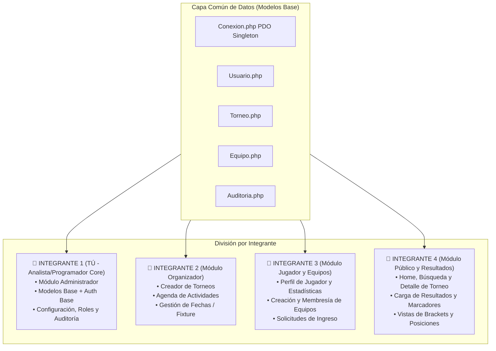

# 🧭 Documento 06: Plan Maestro de Trabajo en Equipo y División del Backend (SGDM - ASCEND)

---

## 🎯 1. Contexto Institucional y Alcance Estudiantil
Este documento establece la estrategia técnica, organizativa y metodológica para el equipo de **4 integrantes** en el marco del proyecto final de **3° año de BT Tecnologías de la Información (ITS Arias-Balparda - Tramo 8)**.

### 🚫 Exclusiones Formales Confirmadas (NO Programar)
Para no malgastar tiempo ni desviar esfuerzos del núcleo evaluable, el sistema excluye formalmente:
* ❌ Procesamiento e integración con pasarelas de pago (MercadoPago, PayPal, Stripe).
* ❌ Integración con APIs de inicio de sesión con redes sociales (OAuth de Google, Facebook, etc.). El acceso es únicamente por email y contraseña local.
* ❌ Inteligencia artificial embebida o modelos de machine learning.
* ❌ Arbitraje automático o visión por computadora.
* ❌ Sistema de apuestas y venta de entradas.
* ❌ Control de acceso físico a recintos deportivos.

### ✅ Alcance Mínimo Obligatorio Exigido por la Letra
1. **Patrón MVC (Modelo-Vista-Controlador)** con separación clara de capas en PHP y MySQL.
2. **Autenticación y Autorización RBAC (Role-Based Access Control)** con control estricto de sesiones.
3. **Gestión de Participantes y Equipos**.
4. **Los 3 Módulos de Competencia Obligatorios**:
   * **Liga** (Todos contra todos / Round-Robin).
   * **Eliminación Directa** (Llaves / Brackets de Playoff).
   * **Sistema Suizo** (Emparejamiento por puntaje acumulado sin repetición de rivales).
5. **Carga y Validación de Resultados** con recálculo automático de la tabla de posiciones.
6. **Portal Público Responsivo** para consulta de torneos, calendarios y tablas.
7. **Panel de Administración General** con auditoría de cambios y seguridad (OWASP Top 10).
8. **Contenedorización en Docker** y scripts de administración en Bash para el servidor Linux.

---

## 👥 2. División de Roles y Responsabilidades (Equipo de 4 Programadores)

Para programar en paralelo **sin pisarse el código en Git**, cada integrante asumirá la responsabilidad de un submódulo independiente con sus propios Controladores y Vistas, consumiendo los Modelos comunes de la base de datos:



---

## ❓ 3. Respuesta a tus Preguntas Clave

### 1. ¿Puedo programar el Administrador de forma íntegra sin depender de mis compañeros?
**¡SÍ, absolutamente!**
El Administrador es el **"Superconjunto" (Módulo Maestro)** de todo el sistema. En el Administrador se crean las disciplinas ([juegos](file:///c:/Users/juani/Documents/GitHub/SGDM/codigo_fuente/vistas/admin/juegos/formulario.html)), se gestionan los [usuarios](file:///c:/Users/juani/Documents/GitHub/SGDM/codigo_fuente/vistas/admin/usuarios/formulario.html), se configuran los [roles y permisos](file:///c:/Users/juani/Documents/GitHub/SGDM/codigo_fuente/vistas/admin/roles/formulario.html), y se auditan los cambios.
Al programar el Administrador, tú construyes la infraestructura común (`Conexion.php`, `Usuario.php`, `Torneo.php`, `Equipo.php`). Tus compañeros no te bloquean a ti; al contrario, ellos utilizarán esos Modelos que tú creaste para alimentar sus vistas específicas.

### 2. ¿Cómo programar sin pisarse el código en Git?
Se debe aplicar la regla de **Separación por Archivos y Ramas (Feature Branching)**:
* Cada programador trabaja en su propia rama de Git (ejemplo: `git checkout -b feature/admin-usuarios`, `feature/organizador-torneos`, `feature/jugador-equipos`).
* Cada programador edita **exclusivamente sus propios archivos**:
  * Tú editas: `controladores/AdminControlador.php` y `vistas/admin/*`.
  * Integrante 2 edita: `controladores/OrganizadorControlador.php` y `vistas/organizador/*`.
  * Integrante 3 edita: `controladores/JugadorControlador.php` y `vistas/jugador/*`.
  * Integrante 4 edita: `controladores/PublicoControlador.php` y `vistas/publico/*`.
* **Regla de oro**: Nadie modifica directamente `Conexion.php` ni la estructura de la base de datos sin previo acuerdo del equipo. Al no tocar los mismos archivos, los conflictos de fusión (*merge conflicts*) en Git son iguales a cero.

### 3. ¿Cómo evitar programar de más desde el Admin?
Para no sobrecargar el panel de administración con funciones que los evaluadores no van a medir o que están fuera del alcance de la letra:
* **Enfócate en los CRUDs estándar**:
  1. CRUD de Usuarios (crear, editar estado activo/inactivo, cambiar rol, resetear clave).
  2. Catálogo de Disciplinas / Juegos (nombre, categoría, jugadores por equipo, puntos).
  3. Visualización y cambio de estado de Torneos (borrador, inscripciones abiertas, en curso, finalizado).
  4. Visualización de Logs de Auditoría y Accesos (requisito explícito de seguridad en la letra).
* **NO programes cosas accesorias** como pasarelas de pago, chats en tiempo real con WebSockets o generadores de certificados en PDF hasta que el flujo principal de torneos esté 100% funcionando y aprobado.

---

## 🗺️ 4. Hoja de Ruta (Roadmap) Cronológico Semana a Semana

Alineado con el cronograma oficial del proyecto (Segunda Entrega: 14 de Septiembre / Entrega Final: 9 de Noviembre):

```
┌─────────────────────────────────────────────────────────────────────────┐
│ SEMANA 1: CIMIENTOS Y GESTIÓN DE USUARIOS (Hito 2da Entrega Fullstack)  │
├─────────────────────────────────────────────────────────────────────────┤
│ • TÚ: Subir base de datos MySQL (35 tablas) y Conexion.php (PDO).       │
│ • Integrante 4: AuthControlador.php (Login, Registro, Logout con hash).  │
│ • TÚ: AdminControlador.php -> CRUD de Usuarios y Asignación de Roles.   │
│ • Integrante 3: Perfil de Jugador (cargar datos y foto).                │
│ • Integrante 2: Perfil de Organizador.                                  │
│ 🎯 RESULTADO: Sistema con login seguro y administración de usuarios.   │
└─────────────────────────────────────────────────────────────────────────┘
                                   │
                                   ▼
┌─────────────────────────────────────────────────────────────────────────┐
│ SEMANA 2: GESTIÓN DE TORNEOS, DISCIPLINAS Y EQUIPOS                     │
├─────────────────────────────────────────────────────────────────────────┤
│ • TÚ: Catálogo de Juegos y Modalidades en el Admin.                     │
│ • Integrante 2: Creador de Torneos en el Organizador (Fechas, Cupos).   │
│ • Integrante 3: Creación de Equipos y Solicitudes de Miembros.          │
│ • Integrante 4: Listado público de Torneos con filtros por disciplina.  │
│ 🎯 RESULTADO: Torneos y equipos dados de alta y listos para competir.  │
└─────────────────────────────────────────────────────────────────────────┘
                                   │
                                   ▼
┌─────────────────────────────────────────────────────────────────────────┐
│ SEMANA 3: MOTOR DE ENCUENTROS Y ALGORITMOS (El Núcleo del Proyecto)     │
├─────────────────────────────────────────────────────────────────────────┤
│ • Integrante 2 + TÚ: Algoritmo 1: Generador de Liga (Round-Robin).      │
│ • Integrante 2 + TÚ: Algoritmo 2: Generador de Llaves (Playoffs).       │
│ • Integrante 2 + TÚ: Algoritmo 3: Emparejamiento Suizo.                 │
│ • Integrante 4: Renderizado de llaves en 'detalle-torneo.html'.         │
│ 🎯 RESULTADO: Fixtures generados automáticamente según el formato.      │
└─────────────────────────────────────────────────────────────────────────┘
                                   │
                                   ▼
┌─────────────────────────────────────────────────────────────────────────┐
│ SEMANA 4: CARGA DE RESULTADOS, POSICIONES Y AUDITORÍA                   │
├─────────────────────────────────────────────────────────────────────────┤
│ • Integrante 4 + TÚ: Carga de resultados (goles/puntos) por partido.    │
│ • TÚ: Recálculo automático de la tabla 'torneo_posiciones'.             │
│ • TÚ: Registro inmutable en 'auditoria_cambios' (quién modificó qué).   │
│ • Integrante 3: Desbloqueo de logros del jugador al ganar partidos.     │
│ 🎯 RESULTADO: Torneo ejecutable de punta a punta (Inicio a Fin).        │
└─────────────────────────────────────────────────────────────────────────┘
                                   │
                                   ▼
┌─────────────────────────────────────────────────────────────────────────┐
│ SEMANA 5: DOCKER, SCRIPTS BASH, TESTING Y DEFENSAS FINALES              │
├─────────────────────────────────────────────────────────────────────────┤
│ • Todo el equipo: Carga de datos de prueba (mínimo 50 registros por     │
│   componente, exigencia formal de la letra de UTU).                     │
│ • Despliegue en Docker (docker-compose.yml con Apache, PHP y MySQL).    │
│ • Scripts en Bash de respaldos automáticos y usuarios de sistema.       │
│ • Pruebas de seguridad OWASP y testing unitario.                        │
│ 🎯 RESULTADO: Proyecto listo para la defensa final y aprobación.        │
└─────────────────────────────────────────────────────────────────────────┘
```

---

## 🤝 5. Protocolo de Comunicación y Buenas Prácticas para el Grupo

1. **Reuniones Rápidas Semanales (Scrum Standup - 15 minutos)**:
   Cada integrante responde 3 preguntas simples:
   * ¿Qué programé desde la última reunión?
   * ¿Qué voy a programar esta semana?
   * ¿Tengo algún bloqueo o necesito una función de otro compañero?
2. **Uso del Diccionario de Datos**:
   Todos deben consultar obligatoriamente el archivo [03_Diccionario_de_Datos_Completo_y_Mapeo_SQL.md](file:///c:/Users/juani/Documents/GitHub/SGDM/Documentos_Juan/03_Diccionario_de_Datos_Completo_y_Mapeo_SQL.md) antes de escribir una consulta SQL, para usar siempre los mismos nombres de columnas y no inventar nombres dispares.
3. **Manejo de Errores con Try/Catch**:
   Toda operación crítica en los controladores debe estar envuelta en un bloque `try { ... } catch (PDOException $e) { ... }` para evitar que la aplicación muestre errores crudos en pantalla.
