# 📊 Código Mermaid para el Diagrama Entidad-Relación (DER) de "ASCEND"

> **Propósito del Documento:**  
> Este documento contiene el código oficial en sintaxis **Mermaid (`erDiagram`)** para generar el **Diagrama Entidad-Relación (DER/ERD)** completo de la base de datos de **SGDM ASCEND** (las 35 tablas físicas).  
> 
> La sintaxis ha sido formateada y optimizada para ser 100% compatible con **[Mermaid.ai](https://mermaid.ai/)**, **[Mermaid Live Editor](https://mermaid.live/)**, Draw.io y visualizadores de Markdown en GitHub.

---

## 📐 Sintaxis y Reglas Utilizadas para Mermaid `erDiagram`

1. **Cardialidades y Conectores Oficiales:**
   - `||--||` : Relación 1 a 1 estricta (ej. `USUARIOS` ➔ `PERFILES_JUGADORES`).
   - `||--o{` : Relación 1 a Muchos opcional (ej. `ROLES` ➔ `USUARIOS`).
   - `||--|{` : Relación 1 a Muchos obligatoria (ej. `TORNEOS` ➔ `PARTICIPANTES_TORNEO`).
   - `}|--|{` : Relación Muchos a Muchos (N:M).
2. **Etiquetas de Relación:** Encerradas en comillas dobles `: "texto descriptivo"` sin signos de puntuación internos para evitar errores de parseo.
3. **Claves Primarias y Foráneas:**
   - `PK`: Primary Key (Clave Primaria).
   - `FK`: Foreign Key (Clave Foránea).
   - `UK`: Unique Key (Clave Única).

---

## 🎨 Código Mermaid Oficial para Copiar y Pegar

```mermaid
erDiagram
    %% ==========================================
    %% 1. ROLES Y PERMISOS
    %% ==========================================
    ROLES {
        int id PK
        string nombre_rol UK
        string descripcion
        int nivel_permiso
    }

    PERMISOS {
        int id PK
        string nombre_permiso UK
        string descripcion
    }

    ROL_PERMISOS {
        int rol_id PK, FK
        int permiso_id PK, FK
        datetime asignado_en
    }

    %% ==========================================
    %% 2. USUARIOS Y HERENCIA DE PERFILES
    %% ==========================================
    USUARIOS {
        int id PK
        string email UK
        string contrasena_hash
        string nombre_completo
        string telefono
        string foto_perfil_url
        int rol_id FK
        boolean esta_activo
        boolean email_verificado
        datetime fecha_registro
        datetime ultimo_acceso
    }

    PERFILES_JUGADORES {
        int usuario_id PK, FK
        string apodo_gamertag
        text bio
        string banner_url
        int nivel
        int experiencia_puntos
        string pais
        string ciudad
        date fecha_nacimiento
        string discord_tag
        string instagram_url
        string twitter_url
    }

    PERFILES_ORGANIZADORES {
        int usuario_id PK, FK
        string nombre_organizacion
        text bio_organizacion
        string localidad
        string telefono_contacto
        string sitio_web
        boolean verificado_oficial
    }

    TOKENS_VERIFICACION_EMAIL {
        int id PK
        int usuario_id FK
        string token UK
        datetime expira_en
        boolean usado
    }

    TOKENS_RECUPERACION {
        int id PK
        int usuario_id FK
        string token UK
        datetime expira_en
        boolean usado
    }

    SESIONES_ACTIVAS {
        int id PK
        int usuario_id FK
        string token_sesion UK
        string ip_origen
        text user_agent
        datetime ultima_actividad
        boolean activa
    }

    LOGS_ACCESO {
        int id PK
        string email_intentado
        int usuario_id FK
        boolean exito
        string ip_origen
        datetime fecha_hora
    }

    %% ==========================================
    %% 3. CATÁLOGOS BASE
    %% ==========================================
    JUEGOS {
        int id PK
        string nombre UK
        string categoria
        int formato_equipo_defecto
        decimal puntos_victoria
        decimal puntos_empate
        decimal puntos_derrota
        boolean activo
    }

    MODALIDADES {
        int id PK
        string nombre UK
        string descripcion
    }

    SISTEMAS_PUNTUACION {
        int id PK
        string nombre UK
        decimal puntos_victoria
        decimal puntos_empate
        decimal puntos_derrota
    }

    %% ==========================================
    %% 4. EQUIPOS Y MEMBRESÍAS
    %% ==========================================
    EQUIPOS {
        int id PK
        string nombre_equipo UK
        string escudo_url
        string descripcion
        int creado_por FK
        boolean activo
        string codigo_invitacion UK
    }

    EQUIPO_MIEMBROS {
        int equipo_id PK, FK
        int usuario_id PK, FK
        datetime fecha_union
        int numero_camiseta
        string posicion
        boolean es_activo
    }

    EQUIPO_CAPITANES {
        int equipo_id PK, FK
        int usuario_id PK, FK
        datetime fecha_asignacion
        int asignado_por FK
        boolean es_capitan_principal
    }

    SOLICITUDES_EQUIPO {
        int id PK
        int equipo_id FK
        int usuario_id FK
        text mensaje
        string estado
        datetime fecha_solicitud
    }

    %% ==========================================
    %% 5. NÚCLEO DE TORNEOS Y COMPETENCIAS
    %% ==========================================
    TORNEOS {
        int id PK
        string nombre
        int juego_id FK
        int organizador_id FK
        int modalidad_id FK
        int sistema_puntuacion_id FK
        string formato
        string estado
        int cupo_max_equipos
        date fecha_inicio
        date fecha_fin
    }

    TORNEO_CAMBIO_ESTADO {
        int id PK
        int torneo_id FK
        string estado_anterior
        string estado_nuevo
        text motivo
        int usuario_id FK
        datetime fecha_cambio
    }

    PARTICIPANTES_TORNEO {
        int id PK
        int torneo_id FK
        string tipo
        int referencia_id
        string nombre
        string estado
        datetime fecha_inscripcion
    }

    TORNEO_ENCUENTROS {
        int id PK
        int torneo_id FK
        int ronda
        int participante_local_id FK
        int participante_visitante_id FK
        decimal resultado_local
        decimal resultado_visitante
        string estado
        int participante_ganador_id FK
    }

    TORNEO_POSICIONES {
        int torneo_id PK, FK
        int participante_id PK, FK
        int partidos_jugados
        int partidos_ganados
        int partidos_empatados
        int partidos_perdidos
        decimal puntos_favor
        decimal puntos_contra
        decimal diferencia_goles
        int puntos
    }

    TORNEO_SUIZO_PAREJAS {
        int torneo_id PK, FK
        int participante_a_id PK, FK
        int participante_b_id PK, FK
        int ronda
        boolean ya_se_enfrentaron
    }

    RESULTADOS_DETALLE {
        int id PK
        int encuentro_id FK
        string tipo_dato
        string valor
    }

    TORNEO_CONFIG {
        int torneo_id PK, FK
        string clave PK
        text valor
    }

    TORNEO_ACTIVIDADES {
        int id PK
        int torneo_id FK
        string titulo
        string tipo
        date fecha
    }

    TORNEO_COMENTARIOS {
        int id PK
        int torneo_id FK
        int usuario_id FK
        string nombre_autor
        string email_autor
        text comentario
    }

    %% ==========================================
    %% 6. GAMIFICACIÓN
    %% ==========================================
    LOGROS {
        int id PK
        string codigo UK
        string nombre
        text descripcion
        int puntos_recompensa
    }

    USUARIO_LOGROS {
        int usuario_id PK, FK
        int logro_id PK, FK
        string estado
        int progreso_actual
        datetime fecha_desbloqueo
    }

    %% ==========================================
    %% 7. COMUNICACIONES Y AUDITORÍA
    %% ==========================================
    NOTIFICACIONES {
        int id PK
        int usuario_id FK
        string tipo
        string titulo
        text mensaje
        boolean leido
    }

    NEWSLETTER_SUBSCRIPTORES {
        int id PK
        string email UK
        boolean activo
    }

    AUDITORIA_CAMBIOS {
        int id PK
        string tabla_afectada
        int registro_id
        string accion
        int usuario_id FK
        string ip_origen
        datetime fecha_hora
    }

    POLITICAS_CONTRASENAS {
        int id PK
        int longitud_minima
        boolean requiere_mayuscula
        boolean requiere_minuscula
        boolean requiere_numero
        int expiracion_dias
    }

    HISTORIAL_CONTRASENAS {
        int id PK
        int usuario_id FK
        text hash_anterior
        datetime fecha_cambio
    }

    LOGS_ACTIVIDAD {
        int id PK
        int usuario_id FK
        string accion
        string ip_origen
        datetime fecha_hora
    }

    %% ==========================================
    %% RELACIONES ENTRE TABLAS
    %% ==========================================
    ROLES ||--o{ USUARIOS : "posee usuarios"
    ROLES ||--|{ ROL_PERMISOS : "agrupa permisos"
    PERMISOS ||--|{ ROL_PERMISOS : "concede permisos"

    USUARIOS ||--|| PERFILES_JUGADORES : "especializa perfil jugador"
    USUARIOS ||--|| PERFILES_ORGANIZADORES : "especializa perfil organizador"

    USUARIOS ||--o{ TOKENS_VERIFICACION_EMAIL : "genera tokens email"
    USUARIOS ||--o{ TOKENS_RECUPERACION : "genera tokens clave"
    USUARIOS ||--o{ SESIONES_ACTIVAS : "inicia sesiones"
    USUARIOS ||--o{ LOGS_ACCESO : "registra accesos"
    USUARIOS ||--o{ NOTIFICACIONES : "recibe notificaciones"

    USUARIOS ||--o{ EQUIPOS : "funda equipos"
    EQUIPOS ||--|{ EQUIPO_MIEMBROS : "contiene miembros"
    PERFILES_JUGADORES ||--|{ EQUIPO_MIEMBROS : "integra equipo"
    EQUIPOS ||--|{ EQUIPO_CAPITANES : "designa capitanes"
    PERFILES_JUGADORES ||--|{ EQUIPO_CAPITANES : "ejerce capitania"
    EQUIPOS ||--o{ SOLICITUDES_EQUIPO : "recibe solicitudes"
    PERFILES_JUGADORES ||--o{ SOLICITUDES_EQUIPO : "solicita unirse"

    JUEGOS ||--o{ TORNEOS : "es juego de"
    MODALIDADES ||--o{ TORNEOS : "define modalidad de"
    SISTEMAS_PUNTUACION ||--o{ TORNEOS : "aplica puntaje a"
    PERFILES_ORGANIZADORES ||--o{ TORNEOS : "organiza torneos"

    TORNEOS ||--|{ PARTICIPANTES_TORNEO : "inscribe participantes"
    TORNEOS ||--|{ TORNEO_ENCUENTROS : "programa fixture"
    TORNEOS ||--|{ TORNEO_POSICIONES : "clasifica en tabla"
    TORNEOS ||--o{ TORNEO_CAMBIO_ESTADO : "registra cambios estado"
    TORNEOS ||--o{ TORNEO_SUIZO_PAREJAS : "empareja formato suizo"
    TORNEOS ||--o{ TORNEO_CONFIG : "configura parametros"
    TORNEOS ||--o{ TORNEO_ACTIVIDADES : "agenda actividades"
    TORNEOS ||--o{ TORNEO_COMENTARIOS : "recibe comentarios"

    TORNEO_ENCUENTROS ||--o{ RESULTADOS_DETALLE : "detalla estadisticas"

    LOGROS ||--|{ USUARIO_LOGROS : "recompensa logros"
    PERFILES_JUGADORES ||--|{ USUARIO_LOGROS : "desbloquea logros"

    USUARIOS ||--o{ HISTORIAL_CONTRASENAS : "guarda historial clave"
    USUARIOS ||--o{ LOGS_ACTIVIDAD : "registra actividad usuario"
    USUARIOS ||--o{ AUDITORIA_CAMBIOS : "audita cambios"
```



---

## 🛠️ Instrucciones para Renderizar en Mermaid.ai / Mermaid Live Editor

1. Copia todo el bloque de código que está arriba dentro de ````mermaid ... ````.
2. Ingresa a **[Mermaid Live Editor](https://mermaid.live/)** o a tu cuenta en **[Mermaid.ai](https://mermaid.ai/)**.
3. Pega el código en el panel de edición de la izquierda.
4. El diagrama se renderizará automáticamente a la derecha mostrando las 35 tablas con sus campos (`PK`, `FK`, `UK`), tipos de datos y relaciones.
5. Puedes exportarlo como **PNG en alta resolución** o en archivo vectorial **SVG**.
