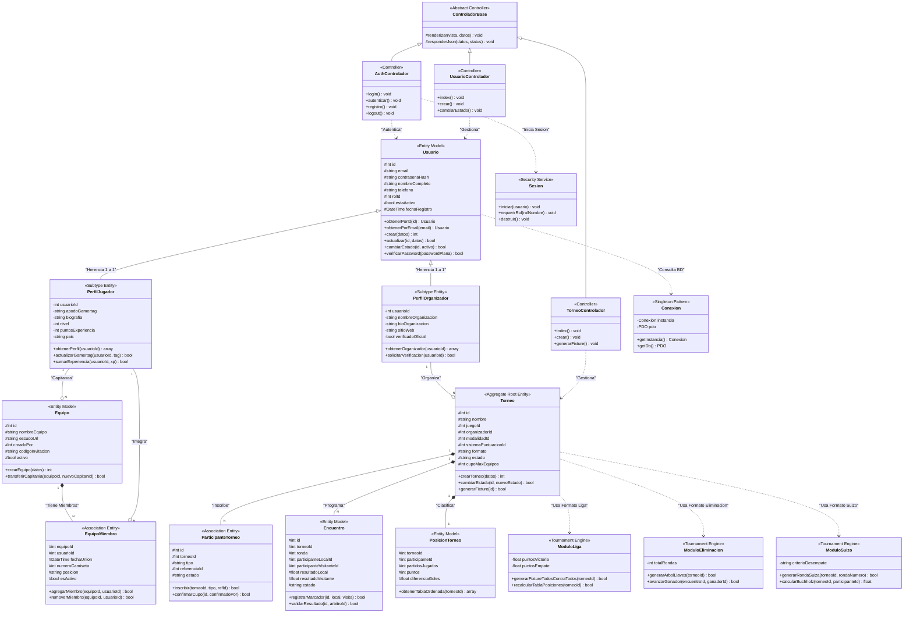

# 🏛️ Guía Definitiva de Diseño: Diagrama de Clases UML para "ASCEND"

> **Propósito del Documento:**  
> Esta guía proporciona la especificación técnica completa para construir el **Diagrama de Clases UML** del sistema **SGDM ASCEND**.  
> Incluye el desglose de todas las clases del backend en PHP (Modelos, Controladores, Motores de Torneo y Servicios de Infraestructura), con la definición exacta de sus **visibilidades, atributos tipados, métodos con parámetros y retornos, y relaciones de asociación, herencia, composición y dependencia**.

---

## 📐 1. Simbología y Normas Estándar del UML de Clases

### 1.1 Visibilidad de Atributos y Métodos
| Símbolo | Significado | Ámbito de Acceso | Ejemplo en PHP |
| :---: | :--- | :--- | :--- |
| **`+`** | **Público (`public`)** | Accisible desde cualquier clase o script. | `+login(): void` |
| **`-`** | **Privado (`private`)** | Accisible solo dentro de la propia clase. | `-contrasenaHash: string` |
| **`#`** | **Protegido (`protected`)** | Accesible por la clase y sus subclases derivadas. | `#id: int` |

### 1.2 Tipos de Relaciones en UML
| Relación UML | Conector Visual | Significado en SGDM ASCEND | Ejemplo en el Sistema |
| :--- | :---: | :--- | :--- |
| **Generalización / Herencia** | `——\|>` | Una clase hija extiende de una clase padre. | `PerfilJugador` extiende de `Usuario` `AuthControlador` extiende de `ControladorBase` |
| **Composición** | `——*` | Relación fuerte de vida: la parte no existe sin el todo. | `Torneo` contiene `Encuentro` (si borro el torneo, mueren sus encuentros). |
| **Agregación** | `——o` | Relación débil: la parte puede existir independientemente. | `Rol` se asigna a `Usuario` (el rol existe aunque se borre un usuario). |
| **Dependencia / Uso** | `··>` | Una clase utiliza a otra temporalmente en un método. | `AuthControlador` usa `Validador` y `Sesion`. |

---

## 📦 2. Inventario Detallado de Clases por Capas Arquitectónicas

---

### Capa A: Modelos de Entidad (`codigo_fuente/modelos/`)

#### 1. `Usuario` *(Superclase de Identidad)*
- **Estereotipo:** `<<Entity Model>>`
- **Atributos:**
  - `#id: int`
  - `#email: string`
  - `#contrasenaHash: string`
  - `#nombreCompleto: string`
  - `#telefono: string`
  - `#fotoPerfilUrl: string`
  - `#rolId: int`
  - `#estaActivo: bool`
  - `#fechaRegistro: DateTime`
- **Métodos:**
  - `+obtenerPorId(id: int): Usuario`
  - `+buscarPorEmail(email: string): array`
  - `+crear(datos: array): int`
  - `+actualizarUsuario(id: int, datos: array): bool`
  - `+cambiarEstadoUsuario(id: int, estado: int): bool`
  - `+eliminarUsuario(id: int): bool`
  - `+obtenerTodosUsuariosConRoles(): array`

#### 2. `PerfilJugador` *(Subclase Subtipo 1:1)*
- **Estereotipo:** `<<Subtype Entity>>`
- **Atributos:**
  - `-usuarioId: int`
  - `-apodoGamertag: string`
  - `-biografia: string`
  - `-nivel: int`
  - `-puntosExperiencia: int`
  - `-pais: string`
  - `-discordTag: string`
- **Métodos:**
  - `+obtenerPerfil(usuarioId: int): array`
  - `+actualizarGamertag(usuarioId: int, tag: string): bool`
  - `+sumarExperiencia(usuarioId: int, xp: int): bool`
- **Relación:** Generalización (`--|>`) con `Usuario`.

#### 3. `PerfilOrganizador` *(Subclase Subtipo 1:1)*
- **Estereotipo:** `<<Subtype Entity>>`
- **Atributos:**
  - `-usuarioId: int`
  - `-nombreOrganizacion: string`
  - `-bioOrganizacion: string`
  - `-sitioWeb: string`
  - `-telefonoContacto: string`
  - `-verificadoOficial: bool`
- **Métodos:**
  - `+obtenerOrganizador(usuarioId: int): array`
  - `+solicitarVerificacion(usuarioId: int): bool`
- **Relación:** Generalización (`--|>`) con `Usuario`.

#### 4. `Equipo` *(Escuadra Deportiva)*
- **Estereotipo:** `<<Entity Model>>`
- **Atributos:**
  - `#id: int`
  - `#nombreEquipo: string`
  - `#escudoUrl: string`
  - `#creadoPor: int`
  - `#codigoInvitacion: string`
  - `#activo: bool`
- **Métodos:**
  - `+crearEquipo(datos: array): int`
  - `+obtenerPorId(id: int): Equipo`
  - `+transferirCapitania(equipoId: int, nuevoCapitanId: int): bool`
  - `+contarTotalEquipos(): int`

#### 5. `EquipoMiembro` *(Entidad de Asociación N:M)*
- **Estereotipo:** `<<Association Entity>>`
- **Atributos:**
  - `#equipoId: int`
  - `#usuarioId: int`
  - `#fechaUnion: DateTime`
  - `#numeroCamiseta: int`
  - `#posicion: string`
  - `#esActivo: bool`
- **Métodos:**
  - `+agregarMiembro(equipoId: int, usuarioId: int): bool`
  - `+removerMiembro(equipoId: int, usuarioId: int): bool`
  - `+obtenerMiembrosPorEquipo(equipoId: int): array`

#### 6. `Torneo` *(Aggregate Root / Núcleo del Sistema)*
- **Estereotipo:** `<<Aggregate Root Entity>>`
- **Atributos:**
  - `#id: int`
  - `#nombre: string`
  - `#juegoId: int`
  - `#organizadorId: int`
  - `#modalidadId: int`
  - `#sistemaPuntuacionId: int`
  - `#formato: string`
  - `#estado: string`
  - `#cupoMaxEquipos: int`
  - `#fechaInicio: Date`
  - `#fechaFin: Date`
- **Métodos:**
  - `+crearTorneo(datos: array): int`
  - `+cambiarEstado(id: int, nuevoEstado: string): bool`
  - `+contarTorneosActivos(): int`
  - `+obtenerUltimosTorneosCreados(limite: int): array`

#### 7. `ParticipanteTorneo` *(Inscripción Polimórfica)*
- **Estereotipo:** `<<Association Entity>>`
- **Atributos:**
  - `#id: int`
  - `#torneoId: int`
  - `#tipo: string`
  - `#referenciaId: int`
  - `#nombre: string`
  - `#estado: string`
- **Métodos:**
  - `+inscribir(torneoId: int, tipo: string, refId: int): bool`
  - `+confirmarCupo(id: int, confirmadoPor: int): bool`

#### 8. `Encuentro` *(Partido / Fixture)*
- **Estereotipo:** `<<Entity Model>>`
- **Atributos:**
  - `#id: int`
  - `#torneoId: int`
  - `#ronda: int`
  - `#participanteLocalId: int`
  - `#participanteVisitanteId: int`
  - `#resultadoLocal: float`
  - `#resultadoVisitante: float`
  - `#estado: string`
  - `#participanteGanadorId: int`
- **Métodos:**
  - `+registrarMarcador(id: int, local: float, visita: float): bool`
  - `+validarResultado(id: int, arbitroId: int): bool`

#### 9. `PosicionTorneo` *(Tabla de Clasificación)*
- **Estereotipo:** `<<Entity Model>>`
- **Atributos:**
  - `#torneoId: int`
  - `#participanteId: int`
  - `#partidosJugados: int`
  - `#partidosGanados: int`
  - `#partidosEmpatados: int`
  - `#partidosPerdidos: int`
  - `#puntosFavor: float`
  - `#puntosContra: float`
  - `#diferenciaGoles: float`
  - `#puntos: int`
- **Métodos:**
  - `+obtenerTablaOrdenada(torneoId: int): array`

#### 10. `Juego`, `Rol`, `Permiso`, `PoliticaContrasena`, `Auditoria`
- **`Juego`**: `#id: int`, `#nombre: string`, `#categoria: string` ➔ `+obtenerTodos(): array`, `+crearJuego(datos: array): bool`, `+actualizarJuego(id: int, datos: array): bool`, `+cambiarEstado(id: int): bool`
- **`PoliticaContrasena`**: `#id: int`, `#longitudMinima: int`, `#expiracionDias: int` ➔ `+obtenerPoliticaVigente(): array`, `+guardarPolitica(datos: array, usuarioId: int): bool`, `+validarPassword(password: string): array`
- **`Rol`**: `#id: int`, `#nombreRol: string`, `#nivelPermiso: int` ➔ `+obtenerPermisos(rolId: int): array`
- **`Auditoria`**: `-id: int`, `-usuarioId: int`, `-accion: string`, `-descripcion: string` ➔ `+registrar(accion: string, descripcion: string): void`, `+obtenerTodos(): array`

---

### Capa B: Motores Algorítmicos de Torneos (*Tournament Engines*)

#### 1. `ModuloLiga` *(Algoritmo Round-Robin / Berger)*
- **Estereotipo:** `<<Tournament Engine>>`
- **Atributos:**
  - `-puntosVictoria: float = 3.0`
  - `-puntosEmpate: float = 1.0`
  - `-puntosDerrota: float = 0.0`
- **Métodos:**
  - `+generarFixtureTodosContraTodos(torneoId: int): bool`
  - `+recalcularTablaPosiciones(torneoId: int): bool`

#### 2. `ModuloEliminacion` *(Algoritmo de Llaves / Árbol Binario)*
- **Estereotipo:** `<<Tournament Engine>>`
- **Atributos:**
  - `-totalRondas: int`
  - `-tieneTercerPuesto: bool`
- **Métodos:**
  - `+generarArbolLlaves(torneoId: int): bool`
  - `+avanzarGanador(encuentroId: int, ganadorId: int): bool`

#### 3. `ModuloSuizo` *(Algoritmo Swiss-System / Buchholz)*
- **Estereotipo:** `<<Tournament Engine>>`
- **Atributos:**
  - `-totalRondas: int`
  - `-criterioDesempate: string = "Buchholz"`
- **Métodos:**
  - `+generarRondaSuiza(torneoId: int, rondaNumero: int): bool`
  - `+calcularBuchholz(torneoId: int, participanteId: int): float`

---

### Capa C: Controladores MVC (`codigo_fuente/controladores/`)

#### 1. `AdminControlador`
- **Estereotipo:** `<<Controller>>`
- **Métodos:**
  - `+dashboard(): void`
  - `+obtenerUltimosJugadores(limite: int): array`
  - `+obtenerUltimosOrganizadores(limite: int): array`

#### 2. `UsuarioControlador`
- **Estereotipo:** `<<Controller>>`
- **Métodos:**
  - `+index(): void`
  - `+crear(): void`
  - `+guardar(): void`
  - `+editar(id: int): void`
  - `+actualizarUsuario(): void`
  - `+cambiarEstado(): void`
  - `+eliminar(): void`
  - `+verComo(): void`
  - `+volverAdmin(): void`

#### 3. `JuegoControlador`
- **Estereotipo:** `<<Controller>>`
- **Métodos:**
  - `+index(): void`
  - `+crear(): void`
  - `+editar(): void`
  - `+actualizar(): void`
  - `+cambiarEstado(): void`

#### 4. `PoliticaContrasenaControlador`
- **Estereotipo:** `<<Controller>>`
- **Métodos:**
  - `+index(): void`
  - `+guardar(): void`

#### 5. `AuditoriaControlador`
- **Estereotipo:** `<<Controller>>`
- **Métodos:**
  - `+index(): void`

---

### Capa D: Servicios e Infraestructura

#### 1. `Conexion` *(Patrón Singleton PDO)*
- **Estereotipo:** `<<Singleton Pattern>>`
- **Atributos:**
  - `-instancia: Conexion = null`
  - `-pdo: PDO`
- **Métodos:**
  - `+getInstance(): Conexion`
  - `+getBD(): PDO`

#### 2. `Sesion` *(Servicio de Seguridad RBAC)*
- **Estereotipo:** `<<Security Service>>`
- **Métodos:**
  - `+iniciarLogin(usuario: array): void`
  - `+validarAdmin(): void`
  - `+esAdmin(): bool`
  - `+destruirSesion(): void`

#### 3. `Validador` *(Servicio de Sanitización)*
- **Estereotipo:** `<<Validation Service>>`
- **Métodos:**
  - `+requerido(valor: string): bool`
  - `+emailValido(email: string): bool`
  - `+enteroEnRango(v: int, min: int, max: int): bool`
  - `+sanitizar(cadena: string): string`

---

## 🎨 3. Diagrama Mermaid Oficial de Clases UML

---

## 🛠️ 4. Instrucciones para Dibujar en Plataformas Visuales

### Opción 1: Draw.io
1. Entra a [Draw.io](https://app.diagrams.net/).
2. Activa la librería **"UML"** en el panel izquierdo.
3. Arrastra las cajas de **"Class"** (divididas en 3 secciones: Nombre, Atributos, Métodos).
4. Utiliza las flechas conectoras oficiales:
   - **Flecha con triángulo hueco (`——|>`)** para Herencia de `Usuario` a `PerfilJugador`.
   - **Flecha con rombo relleno (`——*`)** para Composición de `Torneo` a `Encuentro`.
   - **Flecha punteada (`··>`)** para Dependencia de Controladores a Modelos.

### Opción 2: Mermaid Live Editor
1. Abre [Mermaid Live Editor](https://mermaid.live/).
2. Pega directamente el bloque de código Mermaid de la Sección 3.
3. Exporta la imagen en formato **PNG de alta resolución** o **SVG vectorial**.
