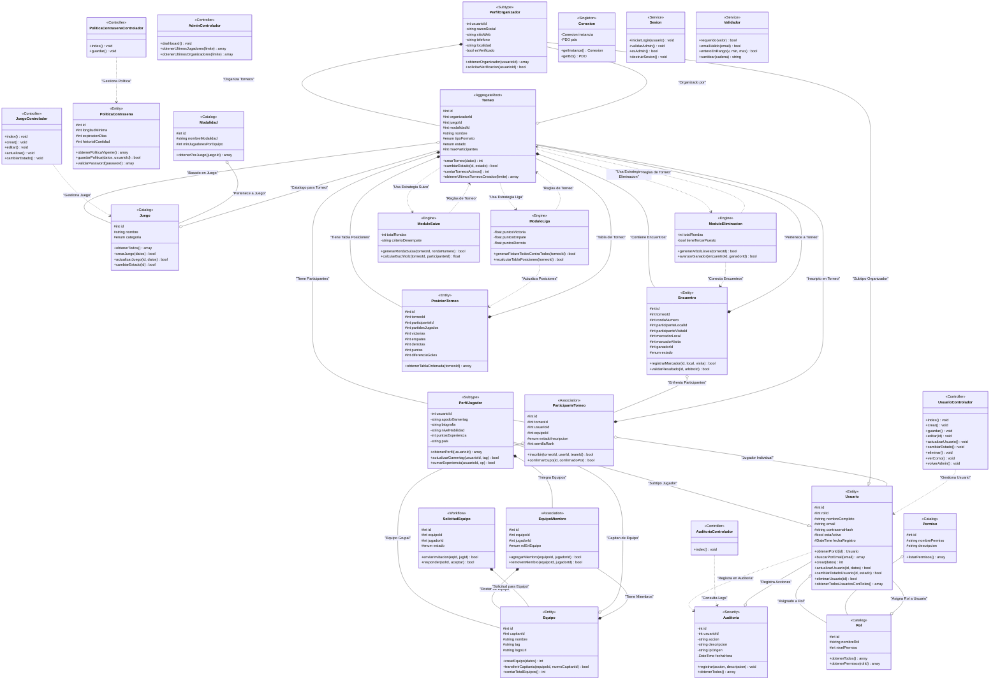

# Diagrama UML SGDM (Versión para Imprimir)

```mermaid
classDiagram
class Usuario {
  <<Entity>>
  #int id
  #int rolId
  #string nombreCompleto
  #string email
  #string contrasenaHash
  #bool estaActivo
  #DateTime fechaRegistro
  +obtenerPorId(id) Usuario
  +buscarPorEmail(email) array
  +crear(datos) int
  +actualizarUsuario(id, datos) bool
  +cambiarEstadoUsuario(id, estado) bool
  +eliminarUsuario(id) bool
  +obtenerTodosUsuariosConRoles() array
}
PerfilJugador --|> Usuario : "Subtipo Jugador"
PerfilOrganizador --|> Usuario : "Subtipo Organizador"
Usuario o-- Rol : "Asignado a Rol"
Usuario ..> Auditoria : "Registra en Auditoria"

class PerfilJugador {
  <<Subtype>>
  -int usuarioId
  -string apodoGamertag
  -string biografia
  -string nivelHabilidad
  -int puntosExperiencia
  -string pais
  +obtenerPerfil(usuarioId) array
  +actualizarGamertag(usuarioId, tag) bool
  +sumarExperiencia(usuarioId, xp) bool
}
PerfilJugador *-- EquipoMiembro : "Integra Equipos"

class PerfilOrganizador {
  <<Subtype>>
  -int usuarioId
  -string razonSocial
  -string sitioWeb
  -string telefono
  -string localidad
  -bool esVerificado
  +obtenerOrganizador(usuarioId) array
  +solicitarVerificacion(usuarioId) bool
}
PerfilOrganizador *-- Torneo : "Organiza Torneos"

class Rol {
  <<Catalog>>
  #int id
  #string nombreRol
  #int nivelPermiso
  +obtenerTodos() array
  +obtenerPermisos(rolId) array
}
Rol o-- Usuario : "Asigna Rol a Usuario"

class Torneo {
  <<AggregateRoot>>
  #int id
  #int organizadorId
  #int juegoId
  #int modalidadId
  #string nombre
  #enum tipoFormato
  #enum estado
  #int maxParticipantes
  +crearTorneo(datos) int
  +cambiarEstado(id, estado) bool
  +contarTorneosActivos() int
  +obtenerUltimosTorneosCreados(limite) array
}
Torneo o-- PerfilOrganizador : "Organizado por"
Torneo o-- Juego : "Basado en Juego"
Torneo *-- Encuentro : "Contiene Encuentros"
Torneo *-- PosicionTorneo : "Tiene Tabla Posiciones"
Torneo *-- ParticipanteTorneo : "Tiene Participantes"
Torneo ..> ModuloLiga : "Usa Estrategia Liga"
Torneo ..> ModuloEliminacion : "Usa Estrategia Eliminacion"
Torneo ..> ModuloSuizo : "Usa Estrategia Suizo"

class ModuloLiga {
  <<Engine>>
  -float puntosVictoria
  -float puntosEmpate
  -float puntosDerrota
  +generarFixtureTodosContraTodos(torneoId) bool
  +recalcularTablaPosiciones(torneoId) bool
}
ModuloLiga ..> Torneo : "Reglas de Torneo"
ModuloLiga ..> PosicionTorneo : "Actualiza Posiciones"

class ModuloEliminacion {
  <<Engine>>
  -int totalRondas
  -bool tieneTercerPuesto
  +generarArbolLlaves(torneoId) bool
  +avanzarGanador(encuentroId, ganadorId) bool
}
ModuloEliminacion ..> Torneo : "Reglas de Torneo"
ModuloEliminacion ..> Encuentro : "Conecta Encuentros"

class ModuloSuizo {
  <<Engine>>
  -int totalRondas
  -string criterioDesempate
  +generarRondaSuiza(torneoId, rondaNumero) bool
  +calcularBuchholz(torneoId, participanteId) float
}
ModuloSuizo ..> Torneo : "Reglas de Torneo"

class Encuentro {
  <<Entity>>
  #int id
  #int torneoId
  #int rondaNumero
  #int participanteLocalId
  #int participanteVisitaId
  #int marcadorLocal
  #int marcadorVisita
  #int ganadorId
  #enum estado
  +registrarMarcador(id, local, visita) bool
  +validarResultado(id, arbitroId) bool
}
Encuentro *-- Torneo : "Pertenece a Torneo"
Encuentro o-- ParticipanteTorneo : "Enfrenta Participantes"

class PosicionTorneo {
  <<Entity>>
  #int id
  #int torneoId
  #int participanteId
  #int partidosJugados
  #int victorias
  #int empates
  #int derrotas
  #int puntos
  #int diferenciaGoles
  +obtenerTablaOrdenada(torneoId) array
}
PosicionTorneo *-- Torneo : "Tabla del Torneo"

class ParticipanteTorneo {
  <<Association>>
  #int id
  #int torneoId
  #int usuarioId
  #int equipoId
  #enum estadoInscripcion
  #int semillaRank
  +inscribir(torneoId, userId, teamId) bool
  +confirmarCupo(id, confirmadoPor) bool
}
ParticipanteTorneo *-- Torneo : "Inscripto en Torneo"
ParticipanteTorneo o-- Usuario : "Jugador Individual"
ParticipanteTorneo o-- Equipo : "Equipo Grupal"

class Equipo {
  <<Entity>>
  #int id
  #int capitanId
  #string nombre
  #string tag
  #string logoUrl
  +crearEquipo(datos) int
  +transferirCapitania(equipoId, nuevoCapitanId) bool
  +contarTotalEquipos() int
}
Equipo o-- PerfilJugador : "Capitan de Equipo"
Equipo *-- EquipoMiembro : "Tiene Miembros"

class EquipoMiembro {
  <<Association>>
  #int id
  #int equipoId
  #int jugadorId
  #enum rolEnEquipo
  +agregarMiembro(equipoId, jugadorId) bool
  +removerMiembro(equipoId, jugadorId) bool
}
EquipoMiembro *-- Equipo : "Roster de Equipo"

class Juego {
  <<Catalog>>
  #int id
  #string nombre
  #enum categoria
  +obtenerTodos() array
  +crearJuego(datos) bool
  +actualizarJuego(id, datos) bool
  +cambiarEstado(id) bool
}
Juego o-- Torneo : "Catalogo para Torneo"

class PoliticaContrasena {
  <<Entity>>
  #int id
  #int longitudMinima
  #int expiracionDias
  #int historialCantidad
  +obtenerPoliticaVigente() array
  +guardarPolitica(datos, usuarioId) bool
  +validarPassword(password) array
}

class Auditoria {
  <<Security>>
  -int id
  -int usuarioId
  -string accion
  -string descripcion
  -string ipOrigen
  -DateTime fechaHora
  +registrar(accion, descripcion) void
  +obtenerTodos() array
}
Auditoria o-- Usuario : "Registra Acciones"

class AdminControlador {
  <<Controller>>
  +dashboard() void
  +obtenerUltimosJugadores(limite) array
  +obtenerUltimosOrganizadores(limite) array
}

class UsuarioControlador {
  <<Controller>>
  +index() void
  +crear() void
  +guardar() void
  +editar(id) void
  +actualizarUsuario() void
  +cambiarEstado() void
  +eliminar() void
  +verComo() void
  +volverAdmin() void
}
UsuarioControlador ..> Usuario : "Gestiona Usuario"

class JuegoControlador {
  <<Controller>>
  +index() void
  +crear() void
  +editar() void
  +actualizar() void
  +cambiarEstado() void
}
JuegoControlador ..> Juego : "Gestiona Juego"

class PoliticaContrasenaControlador {
  <<Controller>>
  +index() void
  +guardar() void
}
PoliticaContrasenaControlador ..> PoliticaContrasena : "Gestiona Politica"

class AuditoriaControlador {
  <<Controller>>
  +index() void
}
AuditoriaControlador ..> Auditoria : "Consulta Logs"

class Permiso {
  <<Catalog>>
  #int id
  #string nombrePermiso
  #string descripcion
  +listarPermisos() array
}
Permiso o-- Rol : "Asociado a Rol"

class Modalidad {
  <<Catalog>>
  #int id
  #string nombreModalidad
  #int minJugadoresPorEquipo
  +obtenerPorJuego(juegoId) array
}
Modalidad o-- Juego : "Pertenece a Juego"

class SolicitudEquipo {
  <<Workflow>>
  #int id
  #int equipoId
  #int jugadorId
  #enum estado
  +enviarInvitacion(eqId, jugId) bool
  +responder(solId, aceptar) bool
}
SolicitudEquipo *-- Equipo : "Solicitud para Equipo"

class Conexion {
  <<Singleton>>
  -Conexion instancia
  -PDO pdo
  +getInstance() Conexion
  +getBD() PDO
}

class Sesion {
  <<Service>>
  +iniciarLogin(usuario) void
  +validarAdmin() void
  +esAdmin() bool
  +destruirSesion() void
}

class Validador {
  <<Service>>
  +requerido(valor) bool
  +emailValido(email) bool
  +enteroEnRango(v, min, max) bool
  +sanitizar(cadena) string
}
```
